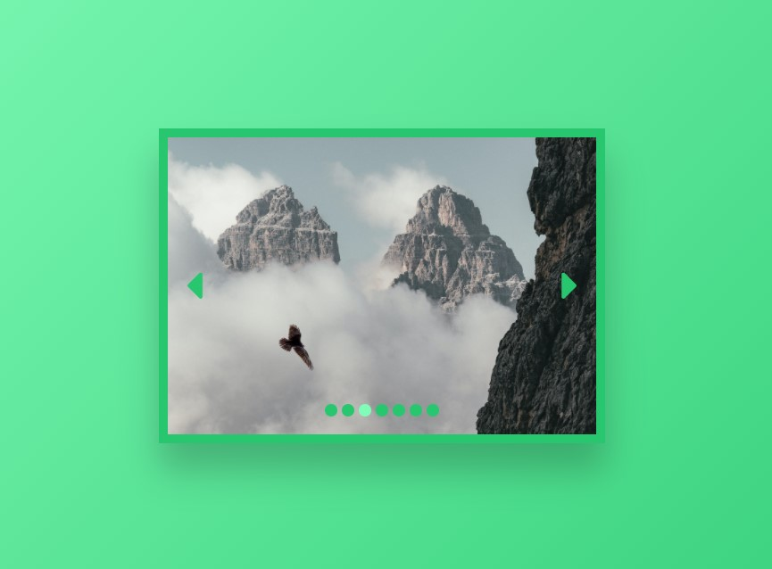

# Gallery Carousel

[This project](https://gurhanalan.github.io/JS-SmallProject-GalleryCarousel/) is a gallery carousel in which users can change the gallery images by clicking the dots and arrow symbols, as well as pressing the arrow keys of keyboard.

## Table of contents

-   [Gallery Carousel](#gallery-carousel)
    -   [Table of contents](#table-of-contents)
    -   [Overview](#overview)
        -   [The challenge](#the-challenge)
        -   [Screenshot](#screenshot)
        -   [Links](#links)
    -   [My process](#my-process)
        -   [Built with](#built-with)

## Overview

### The challenge

Users should be able to:

-   View the optimal layout for the app depending on their device's screen size
-   See hover states for all interactive elements on the page
-   Click buttons and arrows to change images

### Screenshot

### Links

-   Solution URL: [Live Website](https://gurhanalan.github.io/JS-SmallProject-GalleryCarousel/)

## My process

### Built with

-   Semantic HTML5 markup
-   CSS custom properties
-   Desktop-first workflow
-   Javascript
